---
theme:
    name: terminal-dark
    override:
        default:
            colors:
                background: "110000"
                foreground: "ffaa55"
#options:
#    incremental_lists: true
---


<!-- column_layout: [1, 1, 1] -->
<!-- column: 1 -->

`   `

`>>>` _**Ratatui** gave us beautiful TUIs._  
`   ` _**Ratzilla** expanded it to the web._  
`   ` _But why shall we stop there?_  
`   ` _**Why shall we stop anywhere?**_  

<!-- column_layout: [1] -->
<!-- column: 0 -->

Are We Embedded Yet?
===

```
Art by valkyrie
.__________________________________________________.
||////////////////////////////////////////////////||
||////////////////////////////////////////////////||
||////////////////////////////////////////////////||
||////////////////////////////////////////////////||    ___.
||////////////////////////////////////////////////||   /    \
!__________________________________________________!  |      |
|   __ __ __ __ __ __ __ __ __ __  /|\ ATARI 2080ST|  |      |
|__/_//_//_//_//_//_//_//_//_//_/____________--____|  |  .---|---.
| ______________________________________________   |  |  |   |   |
| [][][][][][][][][][][][][][][__] [_][_] [][][][] |  |  |---'---|
| [_][][][][][][][][][][][][]| |[] [][][] [][][][] |  |  |       |
| [__][][][][][][][][][][][][__|[] [][][] [][][][] |  |  |       |
| [_][][][][][][][][][][][][_]            [][][]|| |  |  |  /|\  |
|    [_][________________][_]             [__][]LI |  |   \_____/
|__________________________________________________|  ;
                                                 \___/
```

---

<!-- column_layout: [1, 3, 1] -->
<!-- column: 0 -->
Jagoda Ślązak  
jslazak.com  
github.com/j-g00da  

<!-- column: 2 -->
Rust Gdańsk #9 meetup  
1 July 2025  

<!-- end_slide -->


What is Ratatui?
===
> Ratatui is a Rust crate for cooking up terminal user interfaces (TUIs). 
> It provides a simple and flexible way to create text-based user interfaces in the terminal, 
> which can be used for command-line applications, dashboards, and other interactive console programs.

~ Ratatui docs
<!-- end_slide -->


Pushing TUI to the limits
===
- `cxreiff/`*bevy_ratatui_camera* - `render bevy application frames to the terminal`
- `junkdog/`*tachyonfx*           - `shader-like effects in the terminal`
<!-- end_slide -->


Beyond the terminal...
===
Built-in backends:
- *ratatui-crossterm*                -> `Terminal`
- *ratatui-termion*                  -> `Terminal`
- *ratatui-termwiz*                  -> `You guessed it, Terminal`

Custom backends:
- `gold-silver-copper/`*egui-ratatui*  -> `EGUI widget`
- `j-g00da/`*mousefood*                -> `embedded-graphics draw target`
- `reubeno/`*ratatui-uefi*             -> `UEFI`
- `Jesterhearts/`*ratatui-wgpu*        -> `GPU accelerated rendering to arbitrary buffer`
- `orhun/`*ratzilla*                   -> `Web`
- `gold-silver-copper/`*soft_ratatui*  -> `Pure software rendering to arbitrary buffer`
<!-- end_slide -->


soft_ratatui
===
> Software rendering backend for ratatui. No GPU required. TUI everywhere.
> 
> Fast, portable, no-bloat.
> 
> Optimized for speed, generally faster than running ratatui inside a terminal. 120+ fps on normal workloads.
> Only one dependency, Unicode Font rendering powered by cosmic-text
> Custom portable pixel rasterizer.

~ soft_ratatui docs

<!-- end_slide -->


ratatui-uefi
===
> Implements a ratatui backend for use in UEFI environments.

~ ratatui-uefi docs

<!-- end_slide -->


FOSDEM 2025
===
```
              ▓▓    ░░                                                                                        
        ▓▓   ▒▓▓▒  ▓▓▓                                                                                        
        ▓▓▓▓▓▓▓▓▓▓▓▓▓▓    ░                                                                                   
        ▓▓▓▓▓▓▓▓▓▓▓▓▓▓▓▓▓▓▓                                                                                   
   ▓▓▓▓▓▓▓▓▓        ░▓▓▓▓▓         ▓▓▓▓▓▓▓▓▓  ░▓▓▓▓▓▓▓░    ▓▓▓▓▓▓▓▓░ ░▓▓▓▓▓▓▓▓    ░▓▓▓▓▓▓▓▓▓  ░▓▓▓▓   ▒▓▓▓▓   
     ▒▓▓▓▓            ▓▓▓▓▓▓▓▓     ▓▓▓░      ▒▓▓▓   ▓▓▓▓  ▓▓▓   ░▓▓  ░▓▓▓  ░▓▓▓▓  ░▓▓▓        ░▓▓▓▓░  ▓▓▓▓▓   
     ▓▓▓▓    ▓▒   ▓▒   ▓▓▓▓▓▓      ▓▓▓░      ▓▓▓     ▓▓▓  ▓▓▓▓░      ░▓▓▓    ▓▓▓  ░▓▓▓        ▓▓▓░▓▓ ░▓▓▒▓▓░  
  ▓▓▓▓▓▓▓  ▒▓▓▓▓▒▓▓▓▓  ▒▓▓▓▓       ▓▓▓▓▓▓▓▓ ░▓▓▓     ▓▓▓▒ ░▓▓▓▓▓▓▓░  ░▓▓▓    ▓▓▓▓ ░▓▓▓▓▓▓▓    ▓▓▓ ▓▓░▓▓▓░▓▓   
     ▓▓▓▓   ▓▓▓░ ▓▓▓░  ▓▓▓▓▓▒      ▓▓▓░      ▓▓▓     ▓▓▓░     ░▓▓▓▓  ░▓▓▓    ▓▓▓▒ ░▓▓▓        ▓▓▓ ▓▓▓▓▓░░▓▓▒  
     ░▓▓▓▓            ░▓▓▓▓▓▓▓     ▓▓▓░      ▓▓▓▓   ▓▓▓▓  ▓░    ▓▓▓░ ░▓▓▓   ▓▓▓▓  ░▓▓▓       ░▓▓▓  ▓▓▓▓ ░▓▓▓  
   ▒▓▓▓▓▓▓▓          ▓▓▓▓▓         ▓▓▓░       ▒▓▓▓▓▓▓▓▓  ▒▓▓▓▓▓▓▓▓▓  ░▓▓▓▓▓▓▓▓▓    ▓▓▓▓▓▓▓▓▓  ▓▓▓       ░▓▓▓  
       ░▓▓▓▓▓▓▓▓▓▓▓▓▓▓▓▓▓▓▒                                                                                   
        ▓▓▓▓▓▓▓▓▓▓▓▓▓▓▒  ▓▓                                                                                   
        ▓▓   ▓▓▓▓▓ ▓▓▓                                                                                        
             ░▓▓    ▓░                                                                                                                                                                                                                        
```
<!-- end_slide -->


Ratzilla
===
> Build terminal-themed web applications with Rust and WebAssembly. Powered by Ratatui.

~ Ratzilla docs
<!-- end_slide -->


Rustmeet 2025 (1/2)
===
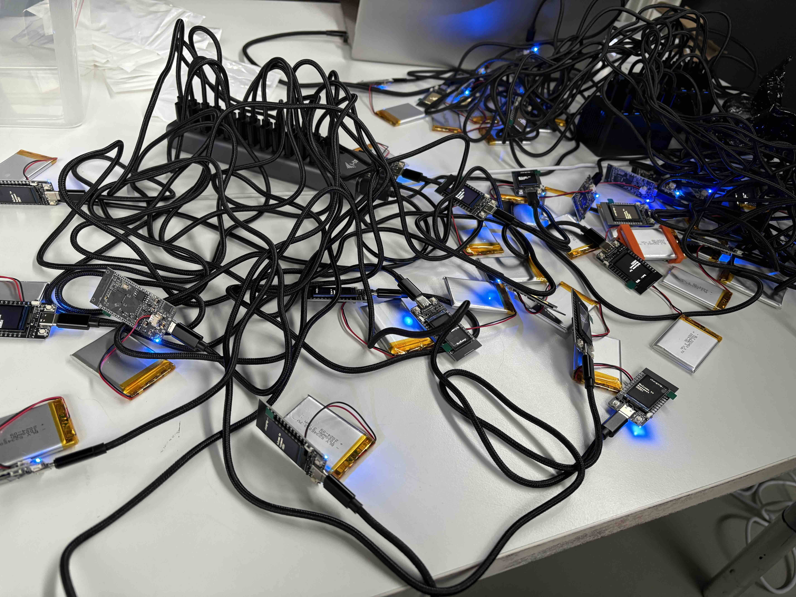
<!-- end_slide -->


Rustmeet 2025 (2/2)
===
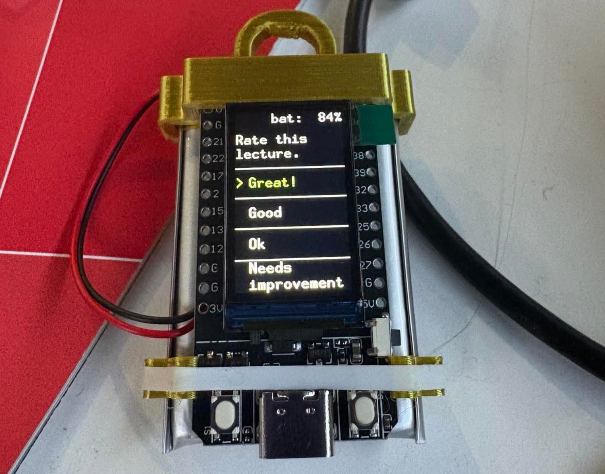
<!-- end_slide -->


Ratatui on Minitel
===

Credit: @plule, https://github.com/plule/minitel
<!-- end_slide -->


Few words about the standard library and `#![no_std]` (1/2)
===
- By default, every new rust project links to `std` crate
- `std` includes and re-exports contents from `core` and `alloc` crates
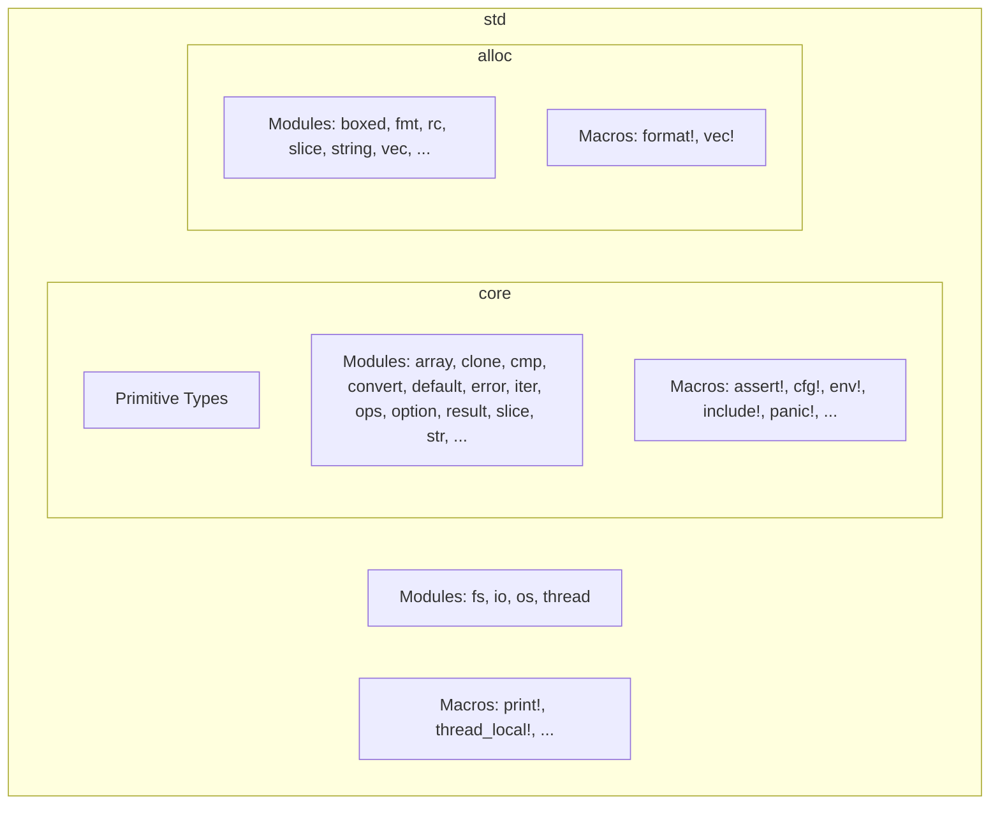
<!-- end_slide -->


Few words about the standard library and `#![no_std]` (2/2)
===
# Adding `no_std` attribute in `lib.rs` or `main.rs` makes the project link to `core` instead of `std`
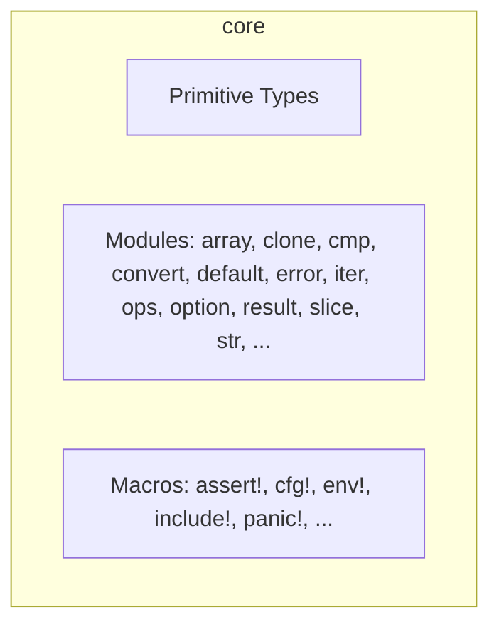
# Results?
`core` only includes abstractions and pure-rust implementations:
- No os-dependant functionalities, because we have no operating system (not entirely true)
- No filesystem
- No printing - we have no stdout after all!
- No threading or TLS
- No heap! - can't dynamically allocate memory, so no `Vec`, no `String` or even pointer types (`Box`, `Rc`, `Arc`, ...)

# Why even bother then?
Your code can run on almost anything, not only desktop, mobile or in the browser, but also on microcontrollers, 
bare-metal, probably also on minecraft redstone, potatoes, ant farm or in your dreams.

<!-- end_slide -->


Std on embedded?
===

# Hardware abstraction layers (HAL) crates for ESP32 family of microcontrollers:

<!-- column_layout: [1, 1] -->
<!-- column: 0 -->

## esp-hal

- Bare metal (`#![no_std]`)
- Development funded by Espressif

<!-- column: 1 -->

## esp-idf-hal

- With standard library support!
- ✨Community effort✨
- Requires a custom toolchain

<!-- end_slide -->


Build your own backend (quickstart)
===
```rust
pub trait Backend {
    /// Error type associated with this Backend.
    type Error: core::error::Error;
    /// Draw the given content to the terminal screen.
    fn draw<'a, I>(&mut self, content: I) -> Result<(), Self::Error>
    where
        I: Iterator<Item=(u16, u16, &'a Cell)>;
    /// Hide the cursor on the terminal screen.
    fn hide_cursor(&mut self) -> Result<(), Self::Error>;
    /// Show the cursor on the terminal screen.
    fn show_cursor(&mut self) -> Result<(), Self::Error>;
    /// Get the current cursor position on the terminal screen.
    fn get_cursor_position(&mut self) -> Result<Position, Self::Error>;
    /// Set the cursor position on the terminal screen to the given x and y coordinates.
    fn set_cursor_position<P: Into<Position>>(&mut self, position: P) -> Result<(), Self::Error>;
    /// Clears the whole terminal screen
    fn clear(&mut self) -> Result<(), Self::Error>;
    /// Clears a specific region of the terminal specified by the [`ClearType`] parameter
    fn clear_region(&mut self, clear_type: ClearType) -> Result<(), Self::Error>;
    /// Get the size of the terminal screen in columns/rows as a [`Size`].
    fn size(&self) -> Result<Size, Self::Error>;
    /// Get the size of the terminal screen in columns/rows and pixels as a [`WindowSize`].
    fn window_size(&mut self) -> Result<WindowSize, Self::Error>;
    /// Flush any buffered content to the terminal screen.
    fn flush(&mut self) -> Result<(), Self::Error>;
}
```
<!-- end_slide -->


embedded-graphics
===
<!-- column_layout: [2, 5] -->
<!-- column: 0 -->


<!-- column: 1 -->

> Embedded-graphics is a 2D graphics library that is focused on memory constrained embedded devices.
> A core goal of embedded-graphics is to draw graphics without using any buffers; the crate is no_std compatible and works without a dynamic memory allocator, and without pre-allocating large chunks of memory. To achieve this, it takes an Iterator based approach, where pixel colors and positions are calculated on the fly, with the minimum of saved state. This allows the consuming application to use far less RAM at little to no performance penalty.

~ embedded-graphics docs

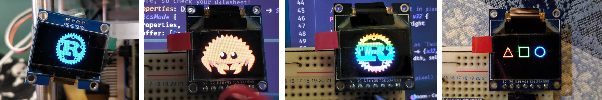
Source: embedded-graphics

<!-- end_slide -->


Mousefood v0.0.1
===

<!-- column_layout: [2, 1] -->
<!-- column: 0 -->

Made a PoC and managed to render a `Hello, World!` using Ratatui.  
Then decided I don't need sleep.

Used `IBM437` crate in order to add _minimal_ unicode support.

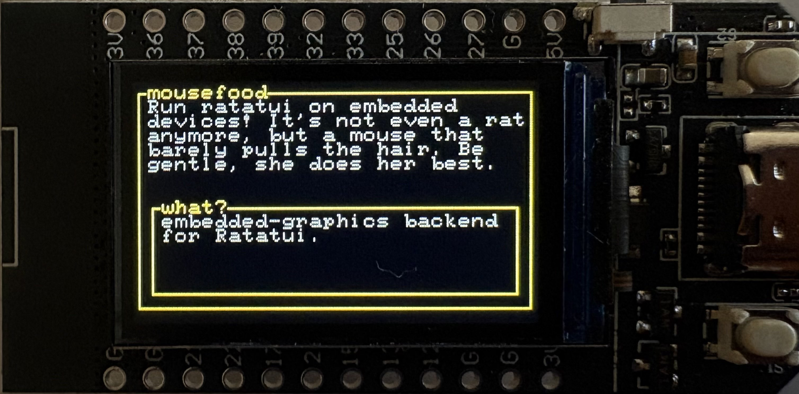

<!-- column: 1 -->

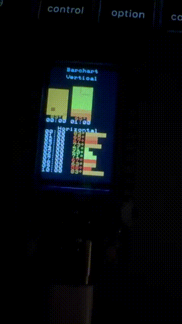

<!-- end_slide -->


Unicode
===
<!-- column_layout: [1, 1] -->
<!-- column: 0 -->

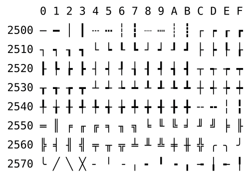

<!-- column: 1 -->

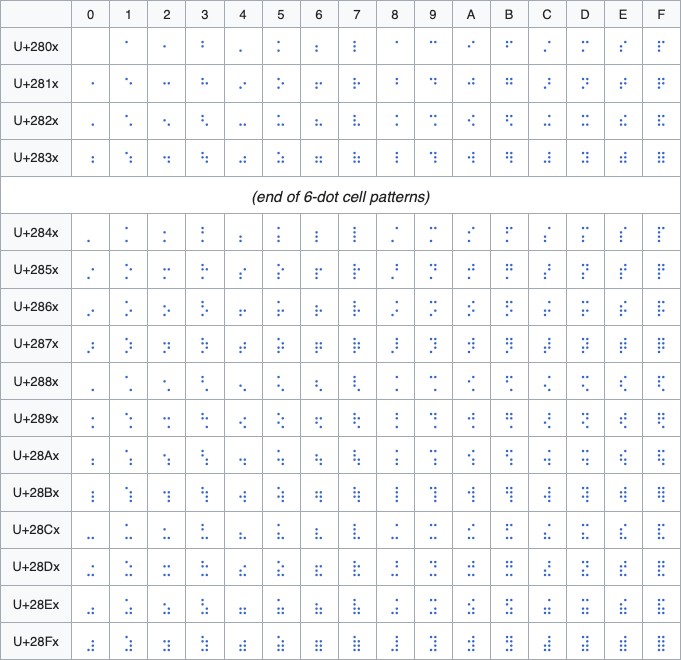

<!-- column_layout: [1] -->
<!-- column: 0 -->

source: Wikipedia

<!-- end_slide -->


Embedded-graphics fonts
===
Designed to fit on most microcontrollers.
Cons:
- Small range of available characters (`ASCII` or `ISO 8859` or `JIS X0201`) making it impossible to draw most widgets.

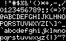

<!-- end_slide -->


IBM437
===
Used for `Mousefood` v0.0.1 and made it possible to draw borders.

Cons:
- Too small set of characters for most widgets 

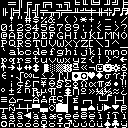
<!-- end_slide -->


embedded-graphics/bdf
===
Idea - use `embedded-graphics/bdf` to generate a custom `embedded-graphics` font.
<!-- end_slide -->


Cozette
===
`the-moonwitch/`*Cozette* (Literally this font) 
<!-- end_slide -->


embedded-graphics-unicodefonts
===
So I made my own font crate...

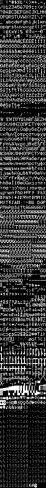

<!-- end_slide -->


Buffer flushing inconsistencies
===
# Many display drivers (e.g. `mipidsi`) write directly to the display, but not all of them...
- Some drivers have a built-in buffer and require flushing to send anything to the display.
- This is not abstracted by embedded-graphics, as using a buffer goes against what embedded-graphics essentially is (a buffer-less graphics library).
# Solution in Mousefood v0.2
Make it possible to pass a `flush_callback`:
```rust
let mut driver = WeActStudio290BlackWhiteDriver::new(spi_interface, busy, rst, delay);
let mut display = Display290BlackWhite::new();

driver.init().unwrap();

let config = EmbeddedBackendConfig {
    flush_callback: Box::new(move |d| { driver.full_update(d).unwrap(); }),
    ..Default::default()
};
let backend = EmbeddedBackend::new(&mut display, config);
```
This works and is pretty simple, but since Mousefood buffers pixels, we now have unnecessary double buffering with some drivers...

# Solution in Mousefood v0.3 (unreleased)
Approach suggested by @deadbaed:  
`BufferedDisplay` trait + separate driver integration crates. (Work in progress)

<!-- end_slide -->


Final notes
===
TODO
<!-- end_slide -->


Demos! (1/4)
===


<!-- end_slide -->


Demos! (2/4)
===

<!-- end_slide -->


Demos! (3/4)
===
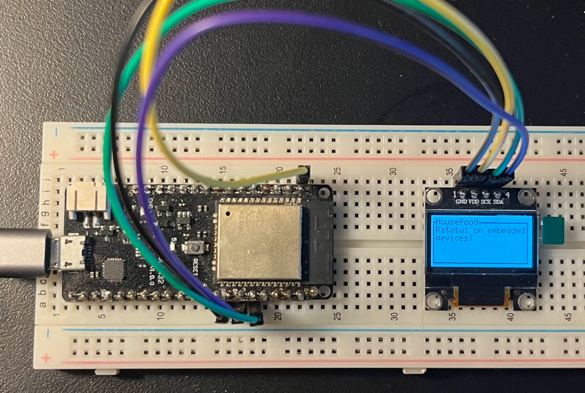
Credit: @deadbaed, https://philippeloctaux.com
<!-- end_slide -->

Demos! (4/4)
===

Credit: @orhun, https://github.com/orhun/tuitar
<!-- end_slide -->


Ok, let's get back to `#![no_std]` thing...
===

# Making Ratatui no-std compatible can't be that hard, right? 
It's just...

<!-- column_layout: [1, 1] -->
<!-- column: 0 -->


<!-- column: 1 -->

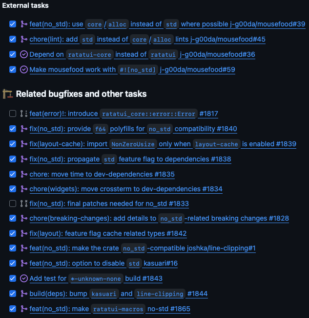

<!-- column_layout: [1] -->
<!-- column: 0 -->
and that's pretty much it. (I don't think this list is complete actually)

<!-- end_slide -->


Required changes (1/5)
===

<!-- column_layout: [1, 1] -->
<!-- column: 0 -->

# Link to `alloc` crate (this requires downstream `no_std` crates to setup a global allocator)
```rust
extern crate alloc;
```
# Use `core` or `alloc` instead of `std` if possible
```diff
- use std::rc::Rc;
+ use alloc::rc::Rc;
- use std::cell::RefCell;
+ use core::cell::RefCell;
```
# Add linter rules that check for unnecessary `std` usages
```rust
#![warn(clippy::std_instead_of_core)]
#![warn(clippy::std_instead_of_alloc)]
#![warn(clippy::alloc_instead_of_core)]
```
# Make it easy to disable `std` features in upstream crates
```toml
[features]
std = ["thiserror/std"]

[dependencies]
thiserror = { workspace = true, default-features = false }
```

<!-- column: 1 -->

# Use `hashbrown` for a drop-in, no-std `HashMap` replacement
```rust
use hashbrown::HashMap;
```
# Use `kasuari` instead of unmaintained `cassowary` crate
# Add necessary feature flags
# Make crate no-std compatible, but still link to `std` by default
```rust
#![no_std]

#[cfg(feature = "std")]
extern crate std;
```

TODO: code snippets
<!-- end_slide -->


Required changes (2/5)
===
# Changes in upstream crates
## `kasuari`
- Change usages of `std` to `core` and `alloc`
- Add `#![no_std]` attribute
- Link in `alloc` crate
- Disable `std` features in dependencies (and add `std` feature flag to re-enable them)
## `line-clipping`
- Adding `#![no_std]` was sufficient


<!-- end_slide -->


Required changes (3/5)
===
# Remove `io::Error` from `Backend` trait
TODO
<!-- end_slide -->


Required changes (4/5)
===
# No-std compatible layout cache
TODO
<!-- end_slide -->


Required changes (5/5)
===
# Create f64 polyfills

<!-- column_layout: [1, 1] -->
<!-- column: 0 -->

Initial idea - create a new crate that wraps `libm`:  

```rust
// j-g00da/float-polyfills/src/float_64.rs
impl F64Polyfill for f64 {
    // (...)
    #[inline]
    fn cos(self) -> f64 {
        libm::cos(self)
    }
    // (...)
}
```
Cons:
- Adds maintenance overhead for an extra crate
- Produces a `libm` dependency, which ~99% of use cases don’t need
  (there’s no idiomatic way to make it optional in `std`; this is why it was removed from `core`)
- `libm` is accurate but slow - we care more about speed than precision here
- We only need a few methods in a few places - feels like overkill

<!-- column: 1 -->

Final implementation - polyfills included directly in `ratatui-widgets`, 
fast approximation of trigonometric functions based on `micromath` crate:  

```rust
// ratatui/ratatui/ratatui-widgets/src/polyfills.rs
// (...)
#[inline]
fn cos(val: f64) -> f64 {
    let mut x = val;
    x *= FRAC_1_PI / 2.0;
    x -= 0.25 + floor(x + 0.25);
    x *= 16.0 * (x.abs() - 0.5);
    x += 0.225 * x * (x.abs() - 1.0);
    x
}
// (...)
impl F64Polyfills for f64 {
    // (...)
    #[inline]
    fn cos(self) -> f64 {
        cos(self)
    }
}
// (...)

// Usage:
#[cfg(not(feature = "std"))]
use crate::polyfills::F64Polyfills;
```

<!-- end_slide -->


No-std Ratatui
===
No-std compatible crates:
- `ratatui` (requires disabling `default-features`)    >= v0.30.0-alpha.4
- `ratatui-core`                                     >= v0.1.0-alpha.5
- `ratatui-widgets`                                  >= v0.3.0-alpha.4
- `ratatui-macros`                                   >= v0.7.0-alpha.3

```zsh +exec
cd ../ratatui
cargo build \
--release \
--package ratatui \
--no-default-features \
--features all-widgets,macros,underline-color,scrolling-regions,unstable \
--target aarch64-unknown-none
```

<!-- end_slide -->


What's next?
===
TODO: upcoming mousefood release
<!-- end_slide -->


Rat in The Wild Challenge
===

<!-- end_slide -->
