---
theme:
    name: terminal-dark
    override:
        default:
            colors:
                background: "110000"
                foreground: "ffaa55"
---

Rustmeet 2025 (1/2)
===
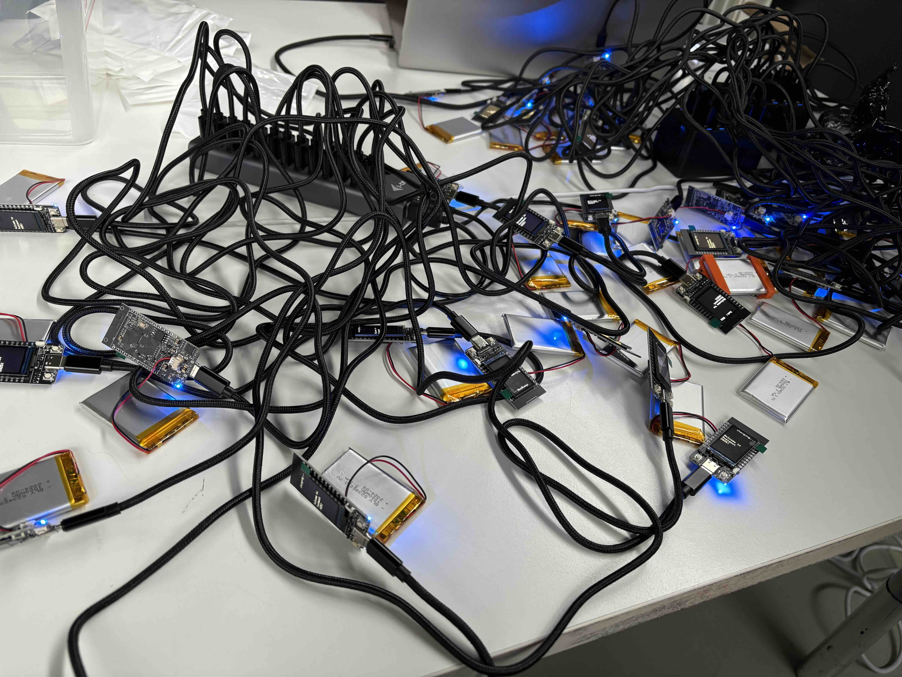

<!-- 
speaker_note: |
  Fast forward one month later.
  I was organizing Rustmeet, which was the first Rust conference in Poland.
  We had this idea to give away esp32 dev boards to all attendees and make some kind of Rust program for it.

  It was pretty crazy, I'm really happy that we managed to pull it off.
-->

<!-- end_slide -->


Rustmeet 2025 (2/2)
===
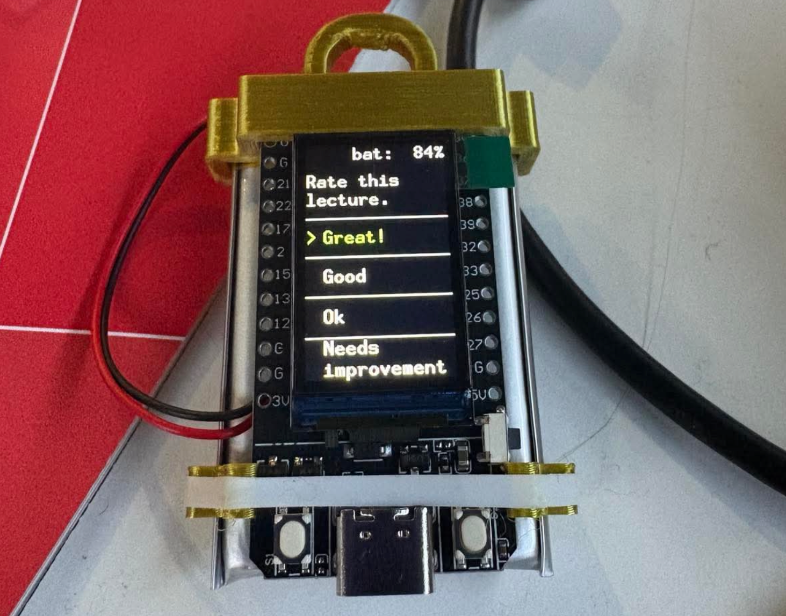

<!-- 
speaker_note: |
  That's the device we gave away, we were able to send messages or questions to it through MQTT.

  By the way, how many of you were at Rustmeet?

  Anyway, we also invited Orhun to give a talk about Ratzilla, and I think it was the moment when I thought,
  "Hey, why not try to run Ratatui on ESP32?"
-->

<!-- end_slide -->


Ratatui on Minitel
===

Credit: @plule, https://github.com/plule/minitel

<!-- 
speaker_note: |
  By the way, I was not the first one to run Ratatui esp32.
  Plule managed to run Ratatui on Minitel using esp32 to send data to it through serial connection.

  It's a pretty cool project, you should check it out.
-->

<!-- end_slide -->


Build your own backend (quickstart)
===
```rust
pub trait Backend {
    /// Error type associated with this Backend.
    type Error: core::error::Error;
    /// Draw the given content to the terminal screen.
    fn draw<'a, I>(&mut self, content: I) -> Result<(), Self::Error>
    where
        I: Iterator<Item=(u16, u16, &'a Cell)>;
    /// Hide the cursor on the terminal screen.
    fn hide_cursor(&mut self) -> Result<(), Self::Error>;
    /// Show the cursor on the terminal screen.
    fn show_cursor(&mut self) -> Result<(), Self::Error>;
    /// Get the current cursor position on the terminal screen.
    fn get_cursor_position(&mut self) -> Result<Position, Self::Error>;
    /// Set the cursor position on the terminal screen to the given x and y coordinates.
    fn set_cursor_position<P: Into<Position>>(&mut self, position: P) -> Result<(), Self::Error>;
    /// Clears the whole terminal screen
    fn clear(&mut self) -> Result<(), Self::Error>;
    /// Clears a specific region of the terminal specified by the [`ClearType`] parameter
    fn clear_region(&mut self, clear_type: ClearType) -> Result<(), Self::Error>;
    /// Get the size of the terminal screen in columns/rows as a [`Size`].
    fn size(&self) -> Result<Size, Self::Error>;
    /// Get the size of the terminal screen in columns/rows and pixels as a [`WindowSize`].
    fn window_size(&mut self) -> Result<WindowSize, Self::Error>;
    /// Flush any buffered content to the terminal screen.
    fn flush(&mut self) -> Result<(), Self::Error>;
}
```

<!-- 
speaker_note: |
  Creating a custom backend is actually pretty simple.
  You just need to implement the `Backend` trait.

  It's just few methods that you would expect, 
  drawing, controlling the cursor, clearing the screen, 
  getting the size of the terminal, flushing the content to the terminal.
  Nothing crazy.
-->

<!-- end_slide -->


embedded-graphics
===
<!-- column_layout: [2, 5] -->
<!-- column: 0 -->


<!-- column: 1 -->

> Embedded-graphics is a 2D graphics library that is focused on memory constrained embedded devices.
> A core goal of embedded-graphics is to draw graphics without using any buffers; the crate is no_std compatible and works without a dynamic memory allocator, and without pre-allocating large chunks of memory. To achieve this, it takes an Iterator based approach, where pixel colors and positions are calculated on the fly, with the minimum of saved state. This allows the consuming application to use far less RAM at little to no performance penalty.

~ embedded-graphics docs


Source: embedded-graphics

<!-- 
speaker_note: |
  Ok so I'm implementing the Backend trait, but what do I draw to?
  The answer is `embedded-graphics`, a graphics library, for well, embedded devices.
-->

<!-- end_slide -->


Mousefood v0.0.1
===

<!-- column_layout: [2, 1] -->
<!-- column: 0 -->

Made a PoC and managed to render a `Hello, World!` using Ratatui.  
Then decided I don't need sleep.

Used `IBM437` crate in order to add _minimal_ unicode support.

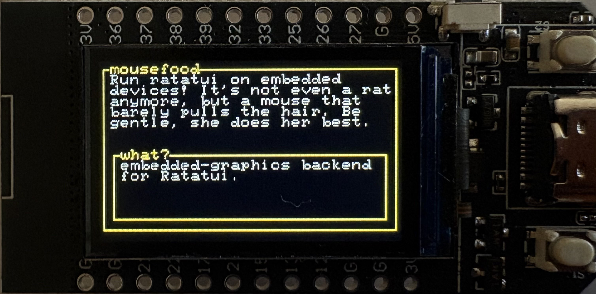

<!-- column: 1 -->

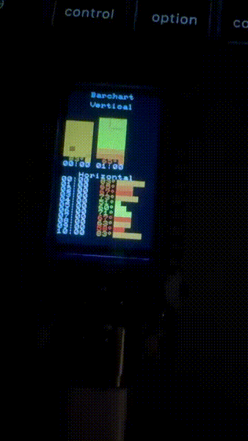

<!-- 
speaker_note: |
  So I made a first, PoC version of this backend, called it Mousefood.
  The name idea was to sound like a Ratatui ripoff.
  
  It was far from perfect, but it worked.
  And that dopamine hit was enough to continue developing it.
-->

<!-- end_slide -->


Unicode
===
<!-- column_layout: [1, 1] -->
<!-- column: 0 -->

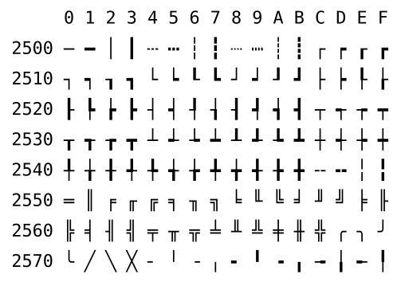

<!-- column: 1 -->

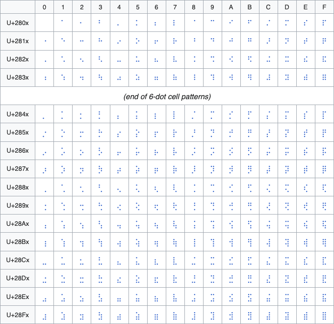

<!-- column_layout: [1] -->
<!-- column: 0 -->

source: Wikipedia

<!-- 
speaker_note: |
  The first problem I had to solve was unicode support.

  Ratatui extensively uses box drawing characters, braille characters and other unicode characters 
  to create nice looking widgets.
-->

<!-- end_slide -->


Embedded-graphics fonts
===
Designed to fit on most microcontrollers.

Cons:
- Small range of available characters (`ASCII` or `ISO 8859` or `JIS X0201`) making it impossible to draw most widgets.

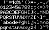

<!-- 
speaker_note: |
  The built-in fonts of embedded-graphics are very lightweight,
  which is understandable, because they are designed to fit on most microcontrollers.

  But our esp32 can fit more, and I wanted more.
-->

<!-- end_slide -->


IBM437
===
Used for `Mousefood` v0.0.1 and made it possible to draw borders.

Cons:
- Too small set of characters for most widgets 


<!-- 
speaker_note: |
  For 0.0.1 I used IBM437 which has some more characters, that's how I was able to draw borders.
  But it's still not enough for most widgets, so I had to find a better solution.
-->

<!-- end_slide -->


embedded-graphics/bdf
===
Idea - use `embedded-graphics/bdf` to generate a custom `embedded-graphics` font.

<!-- 
speaker_note: |
  I've found a bdf project in embedded-graphics org, it's still under development,
  but with some manual work I was able to use it to generate a custom embedded-graphics font.

  Now I just needed to find a bitmap font for that.
-->

<!-- end_slide -->


Cozette
===
`the-moonwitch/`*Cozette* (Literally this font) 


<!-- 
speaker_note: |
  First obvious idea was to use Cozette, it's pretty much the best bitmap monospaced font out there.
  But it had too many characters, and characters weren't small enough.

  So I decided to check what embedded-graphics uses.
-->

<!-- end_slide -->


embedded-graphics-unicodefonts
===
So I made my own font crate...


<!-- 
speaker_note: |
  Embedded graphics uses X-org font collection that is literally named Misc.
  It's public domain, noone knows who made it, it's what I needed.

  So I just regenerated the same fonts but without limiting the character set to ASCII.
-->

<!-- end_slide -->


Buffer flushing inconsistencies
===
# Many display drivers (e.g. `mipidsi`) write directly to the display, but not all of them...
- Some drivers have a built-in buffer and require flushing to send anything to the display.
- This is not abstracted by embedded-graphics, as using a buffer goes against what embedded-graphics essentially is (a buffer-less graphics library).
# Solution in Mousefood v0.2
Make it possible to pass a `flush_callback`:
```rust
let mut driver = WeActStudio290BlackWhiteDriver::new(spi_interface, busy, rst, delay);
let mut display = Display290BlackWhite::new();

driver.init().unwrap();

let config = EmbeddedBackendConfig {
    flush_callback: Box::new(move |d| { driver.full_update(d).unwrap(); }),
    ..Default::default()
};
let backend = EmbeddedBackend::new(&mut display, config);
```
This works and is pretty simple, but since Mousefood buffers pixels, we now have unnecessary double buffering with some drivers...

# Solution in Mousefood v0.3 (unreleased)
Approach suggested by @deadbaed:  
`BufferedDisplay` trait + separate driver integration crates. (Work in progress)

<!-- 
speaker_note: |
  The next problem I had to solve was buffer flushing inconsistencies.
  Some display drivers write directly to the display, and some implement a buffer that needs to be flushed.
  
  I fixed that by introducing a flush_callback, but we are now working on a better solution using 
  separate driver integration crates.
-->

<!-- end_slide -->

Demos! (1/4)
===


<!-- 
speaker_note: |
  Time for some demos.
  As you can see it runs pretty smooth.
-->

<!-- end_slide -->


Demos! (2/4)
===
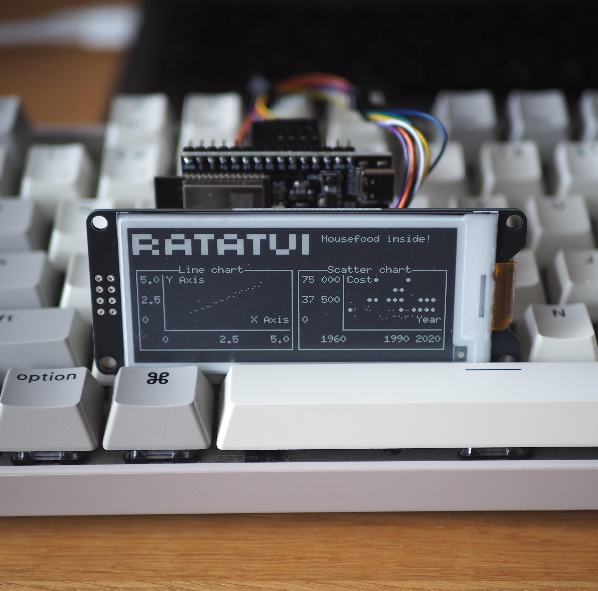

<!-- 
speaker_note: |
  Here it works on e-paper.
-->

<!-- end_slide -->


Demos! (3/4)
===
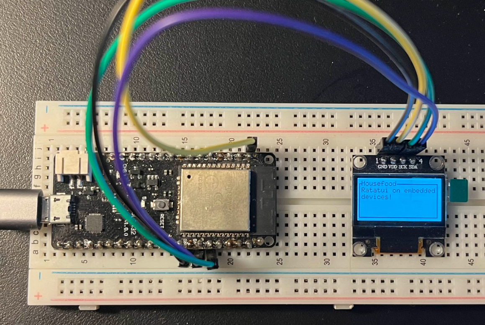
Credit: @deadbaed, https://philippeloctaux.com

<!-- 
speaker_note: |
  Here's a setup of @deadbead, a mousefood contributor.
-->

<!-- end_slide -->

Demos! (4/4)
===

Credit: @orhun, https://github.com/orhun/tuitar

<!-- 
speaker_note: |
  And here's a guitar tuner called Tuitar developed by Orhun.
-->

<!-- end_slide -->


Few words about the standard library and `#![no_std]` (1/2)
===
- By default, every new rust project links to `std` crate
- `std` includes and re-exports contents from `core` and `alloc` crates


<!-- 
speaker_note: |
  Now let's talk about the standard library and `#![no_std]` attribute.

  By default every new rust project links to `std` crate.

  `std` includes and re-exports contents from `core` and `alloc` crates.

  `core` is a minimal subset of the standard library that provides basic functionality,

  `alloc` provides additional functionality for heap allocation such as pointer types and collections like Vec or String.

  The rest of standard library provides abstractions over platform-specific functionality, such as filesystem access, threading, and I/O operations.
-->

<!-- end_slide -->


Few words about the standard library and `#![no_std]` (2/2)
===
# Adding `no_std` attribute in `lib.rs` or `main.rs` makes the project link to `core` instead of `std`

# Results?
`core` only includes abstractions and pure-rust implementations:
- No os-dependant functionalities, because we have no operating system (not entirely true)
- No filesystem
- No printing - we have no stdout after all!
- No threading or TLS
- No heap! - can't dynamically allocate memory, so no `Vec`, no `String` or even pointer types (`Box`, `Rc`, `Arc`, ...)

# Why even bother then?
Your code can run on almost anything, not only desktop, mobile or in the browser, but also on bare-metal 
including microcontrollers.

<!-- 
speaker_note: |
  Adding `#![no_std]` attribute makes the project link to `core` instead of `std`.
  
  This means that we have no os-dependant functionalities, no filesystem, no printing, no threading or TLS, 
  and no heap, so we can't dynamically allocate memory.
  
  But why even bother then? Well, because your code can run on almost anything.
-->

<!-- end_slide -->


Std on embedded?
===

# Hardware abstraction layers (HAL) crates for ESP32 family of microcontrollers:

<!-- column_layout: [1, 1] -->
<!-- column: 0 -->

## esp-hal

- Bare metal (`#![no_std]`)
- Development funded by Espressif

<!-- column: 1 -->

## esp-idf-hal

- With standard library support!
- ✨Community effort✨
- Requires a custom toolchain

<!-- 
speaker_note: |
  How did I ran Ratatui on ESP32 if it requires standard library then?

  Well there is an interesting alternative hardware abstraction layer for ESP32 that supports standard library.
  It's actually pretty crazy, it for example maps std::thread to FreeRTOS tasks.

  You can actually have tokio runtime on esp32 this way.
-->

<!-- end_slide -->


TUI everywhere!
===

# Making Ratatui no-std compatible can't be that hard, right? 
It's just...

<!-- column_layout: [1, 1] -->
<!-- column: 0 -->

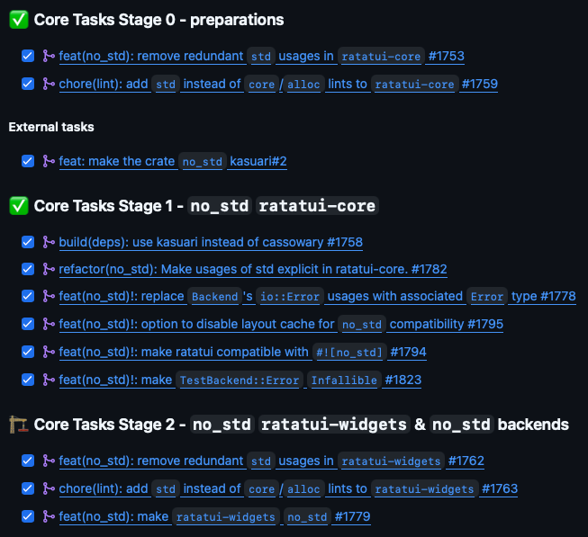

<!-- column: 1 -->

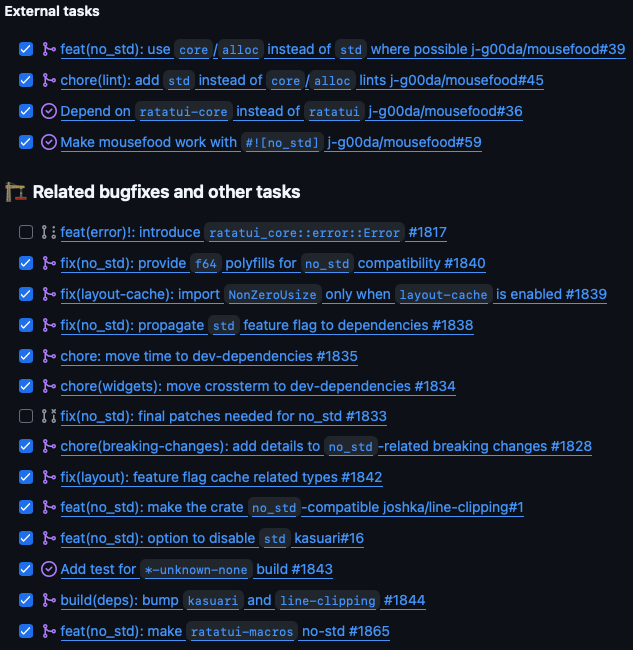

<!-- column_layout: [1] -->
<!-- column: 0 -->
And that's pretty much it. (I don't think this list is complete actually)

<!-- 
speaker_note: |
  So I had Ratatui running on ESP32, that's great but why would I stop there?
  
  I analyzed the Ratatui codebase to find what needs to be changed to make it no-std compatible
  and proposed it to the core team.

  It seemed doable, so we went for it.
-->

<!-- end_slide -->


Required changes (1/5)
===

<!-- column_layout: [1, 1] -->
<!-- column: 0 -->

# Link to `alloc` crate (this requires downstream `no_std` crates to setup a global allocator)
```rust
extern crate alloc;
```
# Use `core` or `alloc` instead of `std` if possible
```diff
- use std::rc::Rc;
+ use alloc::rc::Rc;
- use std::cell::RefCell;
+ use core::cell::RefCell;
```
# Add linter rules that check for unnecessary `std` usages
```rust
#![warn(clippy::std_instead_of_core)]
#![warn(clippy::std_instead_of_alloc)]
#![warn(clippy::alloc_instead_of_core)]
```
# Make it easy to disable `std` features in upstream crates
```toml
[features]
std = ["thiserror/std"]

[dependencies]
thiserror = { workspace = true, default-features = false }
```

<!-- column: 1 -->

# Use `hashbrown` for a drop-in, no-std `HashMap` replacement
```rust
use hashbrown::HashMap;
```
# Use `kasuari` instead of unmaintained `cassowary` crate
```diff
- cassowary
+ kasuari
```
# Add necessary feature flags
```toml
layout-cache = ["std"]
```
# Make crate no-std compatible, but still link to `std` by default
```rust
#![no_std]

#[cfg(feature = "std")]
extern crate std;
```

<!-- 
speaker_note: |
  So what are the required changes?
  
  First of all we need to link to `alloc` crate, because we will be using heap allocation.
  Then we need to change usages of `std` to `core` and `alloc` where possible.
  We also need to add linter rules that check for unnecessary `std` usages.
  We need to make sure that we can disable std features in upstream crates.
  
  Then we need to make sure that we use `hashbrown` for hashmaps, because it has no-std support.
  We also need to switch from unmaintained cassowary crate to kasuari, which is a fork maintained by ratatui org.
  Add necessary feature flags, more on layout cache later.
  And finally we need to make the crate no-std compatible, but still link to `std` by default.
-->

<!-- end_slide -->


Required changes (2/5)
===
# Changes in upstream crates
## `kasuari`
- Change usages of `std` to `core` and `alloc`
- Add `#![no_std]` attribute
- Link to `alloc` crate
- Use `hashbrown` for hashmaps
- Disable `std` features in dependencies (and add `std` feature flag to re-enable them)
## `line-clipping`
- Adding `#![no_std]` was sufficient

```plain
         ,..........   ..........,
     ,..,'          '.'          ',..,
    ,' ,'            :            ', ',
   ,' ,'             :             ', ',
  ,' ,'              :              ', ',
 ,' ,'............., : ,.............', ',
,'  '............   '.'   ............'  ',
 '''''''''''''''''';''';''''''''''''''''''
                    '''
```

<!-- 
speaker_note: |
  We also had to make some changes to two upstream crates, that were pretty straightforward.
-->

<!-- end_slide -->


Required changes (3/5)
===
# Remove `io::Error` from `Backend` trait
- Add associated `Error` type to `Backend` instead of explicit `std::io::Error`
```diff
+ type Error: core::error::Error;
```
```diff
- -> io::Result<()>
+ -> Result<(), Self::Error>
```
- Still use `std::io::Error` in built-in backend implementations, to (mostly) preserve backward compatibility.
```rust 
type Error = std::io::Error;
```

<!-- 
speaker_note: |
  Previously the Backend used io::Error for errors, but we can't use io in no-std.
  So we introduced an associated Error type to Backend trait instead.

  We still use io::Error in built-in backend implementations to preserve backward compatibility.
-->

<!-- end_slide -->


Required changes (4/5)
===
# No-std compatible layout cache
The layout cache uses TLS which is not available.
For now we decided to just put the cache behind a feature flag:
```rust
#[cfg(feature = "layout-cache")]
std::thread_local! {
    static LAYOUT_CACHE: core::cell::RefCell<Cache> = core::cell::RefCell::new(Cache::new(
        NonZeroUsize::new(Layout::DEFAULT_CACHE_SIZE).unwrap(),
    ));
}
```

I also experimented with an implementation using `critical_section`:
```rust
use critical_section::Mutex;
use once_cell::sync::Lazy;

static LAYOUT_CACHE: Lazy<Mutex<RefCell<Cache>>> = Lazy::new(|| {
    Mutex::new(RefCell::new(LruCache::new(NonZeroUsize::new(Layout::DEFAULT_CACHE_SIZE).unwrap())))
});
```
...but it's far from perfect and adds two new dependencies that won't be required most of the time.

<!-- 
speaker_note: |
  The most computationally expensive part of Ratatui is computing layout constraints.
  To speed it up, especially when there are a lot of constraints for example in tables, we use a layout cache.

  Our layout cache uses TLS, which requires std.

  I experimented a bit with implementation using critical_section and once_cell,
  but it's not that great and pulls two new dependencies.
  We decided to put the cache behind a feature flag, so it can be disabled in no-std builds.
-->

<!-- end_slide -->


Required changes (5/5)
===
# Create f64 polyfills

<!-- column_layout: [1, 1] -->
<!-- column: 0 -->

Initial idea - create a new crate that wraps `libm`:  

```rust
// j-g00da/float-polyfills/src/float_64.rs
impl F64Polyfill for f64 {
    // (...)
    #[inline]
    fn cos(self) -> f64 {
        libm::cos(self)
    }
    // (...)
}
```
Cons:
- Adds maintenance overhead for an extra crate
- Produces a `libm` dependency, which ~99% of use cases don’t need
  (there’s no idiomatic way to make it optional in `std`; this is why it was removed from `core`)
- `libm` is accurate but slow - we care more about speed than precision here
- We only need a few methods in a few places - feels like overkill

<!-- column: 1 -->

Final implementation - polyfills included directly in `ratatui-widgets`, 
fast approximation of trigonometric functions based on `micromath` crate:  

```rust
// ratatui/ratatui/ratatui-widgets/src/polyfills.rs
// (...)
#[inline]
fn cos(val: f64) -> f64 {
    let mut x = val;
    x *= FRAC_1_PI / 2.0;
    x -= 0.25 + floor(x + 0.25);
    x *= 16.0 * (x.abs() - 0.5);
    x += 0.225 * x * (x.abs() - 1.0);
    x
}
// (...)
impl F64Polyfills for f64 {
    // (...)
    #[inline]
    fn cos(self) -> f64 {
        cos(self)
    }
}
// (...)

// Usage:
#[cfg(not(feature = "std"))]
use crate::polyfills::F64Polyfills;
```

<!-- 
speaker_note: |
  I mentioned earlier, that core includes primitive types.
  But it's not true when it comes to their methods.
  Some are missing, like trigonometric functions in float types.

  Since we needed some of them, we had to create sone kind of polyfill.
  
  My initial idea was to create a new crate that wraps `libm`, which implements floating point math in pure Rust.
  But it adds a new dependency, and libm is not that fast, so it was not a good idea.

  We ended up implementing polyfills directly in ratatui, 
  and used fast approximation of trigonometric functions based on `micromath` implementation.
-->

<!-- end_slide -->


No-std Ratatui
===
No-std compatible crates:
- `ratatui` (requires disabling `default-features`)    >= v0.30.0-alpha.4
- `ratatui-core`                                     >= v0.1.0-alpha.5
- `ratatui-widgets`                                  >= v0.3.0-alpha.4
- `ratatui-macros`                                   >= v0.7.0-alpha.3

```zsh +exec
cd ../ratatui
cargo build \
--release \
--package ratatui \
--no-default-features \
--features all-widgets,macros,underline-color,scrolling-regions,unstable \
--target aarch64-unknown-none
```

<!-- 
speaker_note: |
  Latest Ratatui alpha release is no-std compatible!
-->

<!-- end_slide -->


What's next?
===
# We are planning to release Ratatui v0.30 soon!

<!-- column_layout: [4, 3] -->
<!-- column: 0 -->

The biggest update since forking tui-rs:
- Modularization
- `no_std` compatibility
- Simpler API (centering ~~a div~~ was never as easy)
- Improved documentation
- Block border merging
- Better serialization support
- Much, much more...

# Mousefood v0.3 will follow soon after.
- Modularity
- `no_std` compatibility
- Cursor support
- Better modifiers support
- More examples and better documentation
- And more...

<!-- column: 1 -->

```plain
  ,,==.
 //    `
||      ,--~~~~-._ _(\--,_
 \\._,-~   \      '    *  `o
  `---~\( _/,___( /_/`---~~
        ``==-    `==-,
```

```plain
         _--"-.
      .-"      "-.
     |""--..      '-.
     |      ""--..   '-.
     |.-. .-".    ""--..".
     |'./  -_'  .-.      |
     |      .-. '.-'   .-'
     '--..  '.'    .-  -.
          ""--..   '_'   :
                ""--..   |
                      ""-' mga
```

<!-- 
speaker_note: |
  We are releasing Ratatui v0.30 soon, and Mousefood v0.3 will follow soon after.
-->

<!-- end_slide -->


Rat in The Wild Challenge
===


<!-- 
speaker_note: |
  We launched Rat in The Wild Challenge, a challenge to create something wild with Ratatui.
  So if you want to run Ratatui on a toaster or make a TUI tool for managing your termite farm, go for it!
-->

<!-- end_slide -->


Acknowledgements
===
<!-- column_layout: [1, 1, 1] -->
<!-- column: 0 -->

# Special thanks to:

*Adrian Papari*   
`@junkdog`
- tachyonfx

*Clement Tsang*   
`@ClementTsang`
- bottom (btm)

*Cooper Reiff*  
`@cxreiff`
- bevy_ratatui_camera
- ttysvr

*Florian Dehau*  
`@fdehau`
- original author of tui-rs, who made ratatui possible

`@Jesterhearts`
- ratatui-wgpu

<!-- column: 1 -->

*Léopold Koprivnik*  
`@SkwalExe`
- rsfrac

*Orhun Parmaksız*  
`@orhun`
- ratzilla
- tuitar

*Philippe Loctaux*  
`@deadbaed`
- a lot of help on mousefood v0.3

*Pierre Lulé*  
`@plule`
- minitel

*Reuben Olinsky*  
`@reubeno`
- tui-uefi

<!-- column: 2 -->

*Stephen Korzen*  
`@gold-silver-copper`
- egui-ratatui
- soft_ratatui

# And all contributors to Ratatui and its ecosystem!

ASCII arts from:  
`www.asciiart.eu`, `ascii.co.uk`

```
 ()()         ____
 (..)        /|o  |
 /\/\       /o|  o|
c\db/o...  /o_|_o_|   -Row
```
